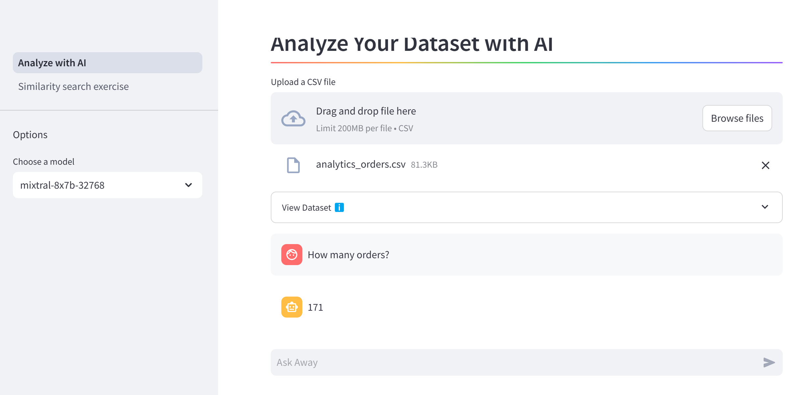

# streamlit_project
Streamlit Pages

This is an experimental project to check out the features provided by streamlit.
You'll have to create a username to access the pages
Make sure to replace the API secrets in the secrets.toml file

## Pages

- 1. Analyze with AI

Checks out the PandasAI library that converses with available LLM's. I've used the LLM provided by [GROQ](https://console.groq.com/login) 

- 2.Similarity search exercise

Tests the performace of the various sentence embedding models provided via the transformers module and check for similarity scores using cosine similarity, dot product and euclidean distance available in the util python module.

